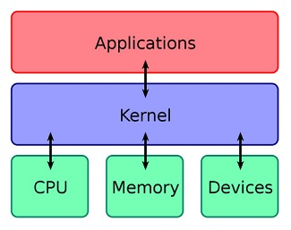
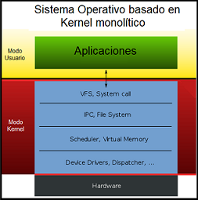
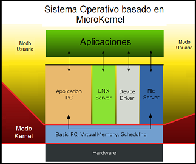
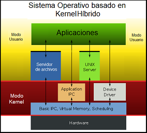
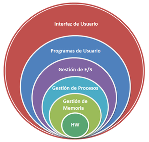
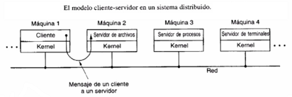
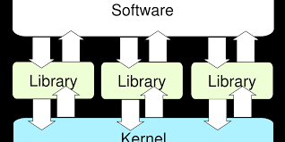

##### Virginia Sarai Gutierrez Depaz 201504443

 

# Kernel
un software especial que forma parte importante del sistema operativo de cualquier ordenador. Por lo general, cuenta con la característica de que el mismo se ejecuta en un modo privilegiado, también llamado y mejor conocido como modo núcleo. Dentro de sus principales funciones, está el hecho de que facilita cualquier programa principal y necesario en el hardware del ordenador y es el encargado de gestionar cada uno de ellos para que funcionen de forma correcta.

# Tipos de Kernel y  Diferencias
Los diferentes sistemas operativos y dispositivos finales tienen diferentes tipos de kernels. Según sus características

- Kernel Monolitico:
Todo está incluido en un mismo espacio lógico o programa en el que se entrelazan todas las funciones o subrutinas.
Es totalmente responsable de la gestión de la memoria y los procesos, la comunicación entre procesos y proporciona funciones de soporte de controladores y hardware. Los sistemas operativos que utilizan kernels monolíticos incluyen Linux, OS X y Windows.

- Microkernel:
e caracteriza por un kernel muy pequeño con solo las funciones primitivas y llamadas al sistema para servicios básicos de espacios de direcciones, comunicación entre procesos y planificación básica.
Es deliberadamente pequeño para que una falla no destruya todo el sistema operativo. Pero para que pueda realizar las mismas funciones que el kernel grande, se divide en varios módulos. Como ejemplo de una aplicación, solo el componente Mach de OS X, ya que ningún sistema operativo tiene un microkernel hasta el momento.

- Kernel Hibrido:
Microkernel modificado que incluye más funcionalidades y las inserta dentro del kernel.
 La combinación de un kernel monolítico y un microKernel se denomina kernel híbrido. En este caso, los kernels grandes se vuelven más compactos y escalables. Otras partes del núcleo se pueden cargar dinámicamente. Esto ya sucede hasta cierto punto en Linux y OS X.

- Kernel Jerárquicos, Multicapas o en anillos: 
Hay diferentes capas o anillos en función de los componentes del kernel y cada uno tiene un nivel jerárquico siendo los más externos los de menores privilegios.

- Kernel Distribuido:
Separa sus componentes en servidores que se distribuyen en uno o varios nodos y el reducido kernel se encarga simplemente de la comunicación de los componentes

- ExoKernel: no proveen abstracciones de hardware, pero permiten el uso de librerias que brindan mayor funcionalidad debido al acceso directo o casi directo al hardware.

# User vs Kernel model